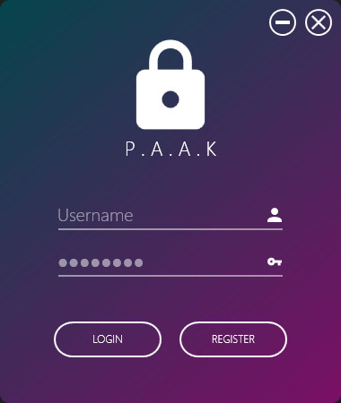
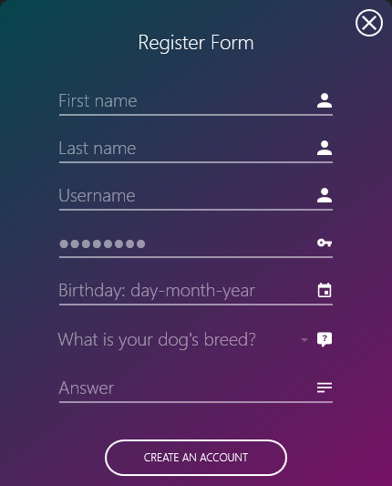
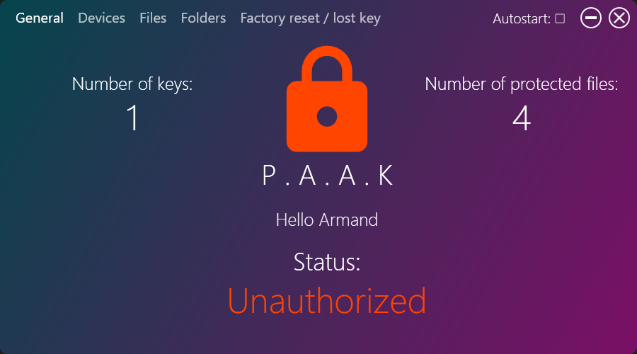
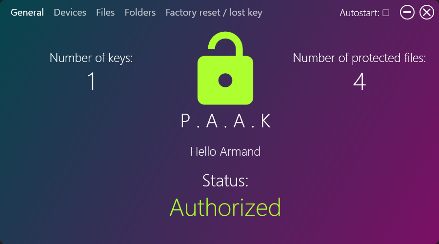
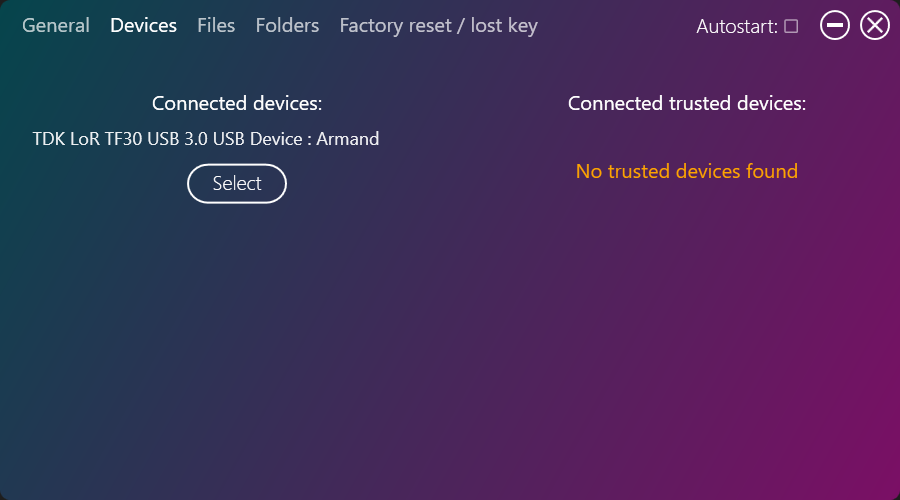
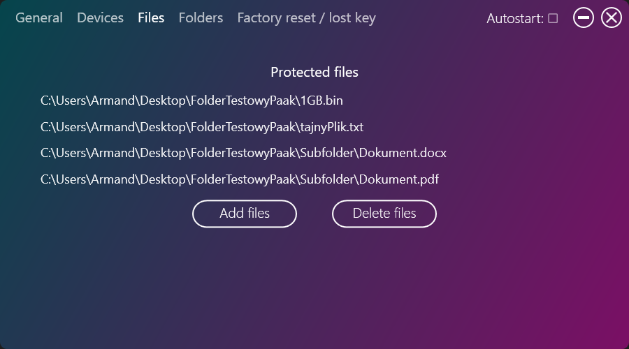
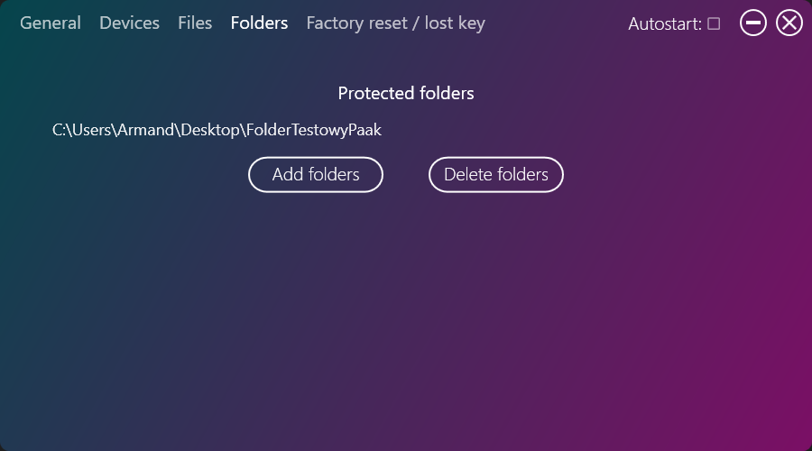
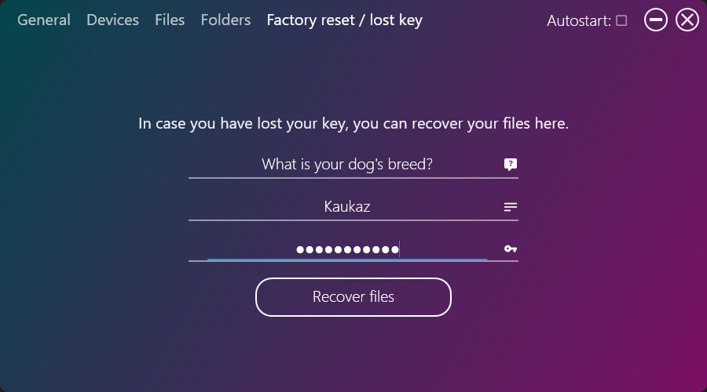

# PAAK (Pendrive as a key) - Security Software
## Table of Contents
* [License](#License)
* [General info](#general-info)
* [Technologies](#technologies)
* [Setup](#setup)
* [Features](#features)
* [Status](#status)
* [Inspiration](#inspiration)
* [Contact](#contact)
* [Screenshots](#screenshots)

## License
Copyright (c) 2021 Armand Pajor  
PAAK is provided as-is under the MIT license for noncomercial and educational purposes.

## General info
This program allows to create an authentication key from USB device and protect your files.  
Program works offline and every user has an independent account.
Files stay encrypted until you connect your authentication USB device key which is related to your account and your files.  
	
## Technologies
Project is created with:
* C# .NET Core version: 3.1
* MahApps Icon Packs https://github.com/MahApps/MahApps.Metro
* Newtonsoft version: 12.0.3
* Material Design Themes version: 3.2.0
	
## Setup
### Prerequisites
Windows .NET Framework 4.0

### Instalation
Download PAAK.exe from Paak_portable folder https://github.com/Armand98/paak/blob/master/Paak_portable/PAAK.exe
	
## Features
* Login
* Registration
* USB devices monitoring system
* Creating an authentication key from USB device with RSA cryptography
* Files and folders explorer
* Files AES cryptography
* Factory reset and data recovery

## Status
1.0 version released

## Inspiration
Project inspired by YubiKey

## Contact
Email: pajorarmand@gmail.com

## Screenshots
1. Login screen:  

2. Registration screen:  

3. General information screen (Unauthorized):  

4. General information screen (Authorized):  

5. Devices screen:  

6. Files screen:  

7. Folders screen:  

8. Factory reset (files recovery):  

